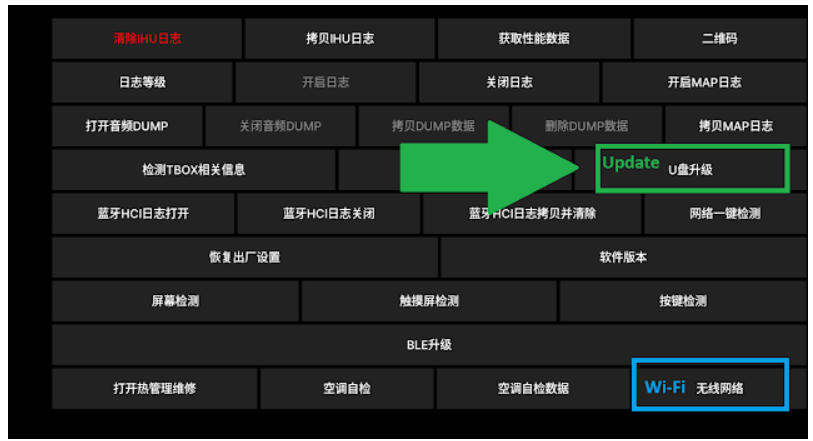
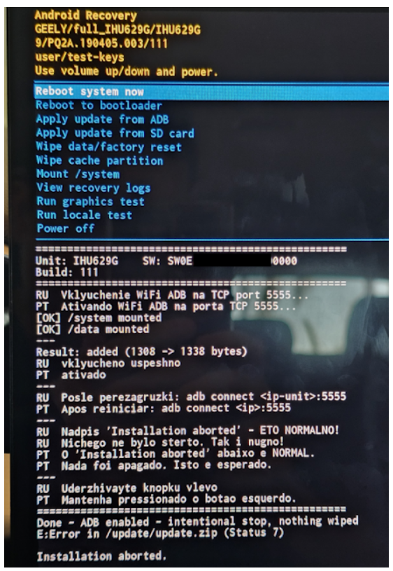
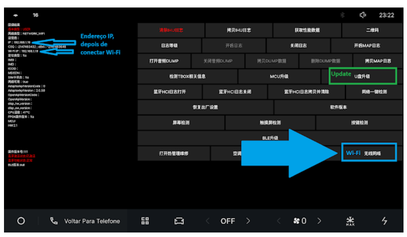
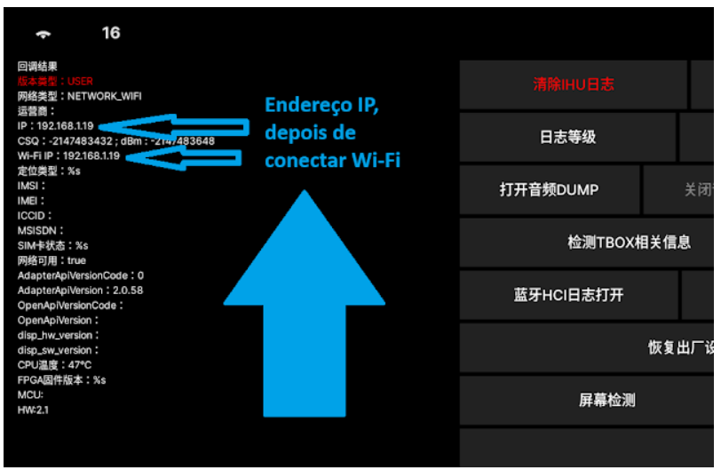
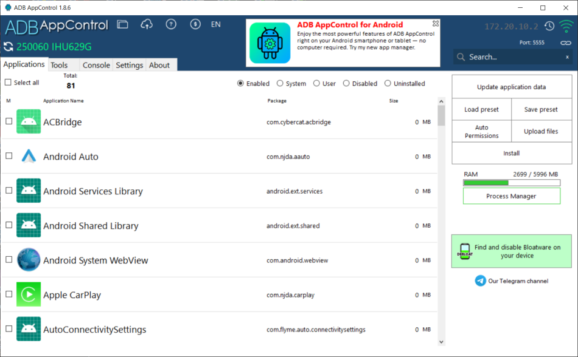

# Hướng dẫn mở khóa và cài đặt phần mềm cho màn hình Geely EX2

> Nguồn tham khảo: [Xe Thông Minh](https://xethongminh.net/threads/huong-dan-mo-khoa-va-cai-dat-phan-mem-cho-man-hinh-xe-geely-ex2.5527/)

## 1. Kiểm tra phiên bản màn hình

Hướng dẫn chỉ áp dụng cho màn hình:

- **IHU629G** của Beidou Intelligent Connected Vehicle Technology Co., Ltd.
- Model **EEBADF1**.
- Flyme Auto E 1.8.0, bản **1111 hoặc 1114**.

Vào **Cài đặt xe → Xe của tôi** để kiểm tra. Nếu thông tin không đúng, không nên tiếp tục.

> Mọi thao tác đều do bạn tự chịu trách nhiệm. Thao tác sai có thể khiến hệ thống mất ổn định hoặc phải cài lại phần mềm màn hình.

## 2. Chuẩn bị USB và gói vá

Chuẩn bị USB định dạng **FAT32**, sau đó tải gói vá đúng phiên bản:

- [Gói vá bản 1111](https://drive.google.com/file/d/1rvTfF4WoTgXcZ98_y73fKRayZVBgxaOZ/view)
- [Gói vá bản 1114](https://drive.google.com/file/d/1RF5ut5r_zVGCxfe2O3LKc3SrecRVp3td/view)

Giải nén thư mục chính vào USB nhưng **không giải nén `update.zip`**.

```text
USB
└── 3C6025_..._user_995
    └── OS
        └── update.zip
```

## 3. Mở menu kỹ thuật



1. Cắm USB vào xe và chờ màn hình nhận thiết bị.
2. Tắt Bluetooth để ngắt kết nối điện thoại.
3. Mở ứng dụng **Điện thoại** trên màn hình.
4. Nhập mã theo công thức:

| Chế độ | Công thức mã |
|---|---|
| Engineering Mode | `#*(tháng + 10)(ngày)(giờ)` |
| Dialer Mode | `#*(tháng + 5)(ngày)(giờ)` |

Giờ sử dụng định dạng 12 giờ và luôn có hai chữ số.

Ví dụ ngày 20/07 lúc 19 giờ:

- Engineering Mode: `#*172007`
- Dialer Mode: `#*122007`

## 4. Áp dụng bản vá



1. Trong menu kỹ thuật, chọn biểu tượng cài đặt bản cập nhật.
2. Màn hình sẽ tự khởi động vào Recovery và chạy gói vá.
3. Thông báo lỗi ở cuối quá trình là **một phần có chủ ý của quy trình**.
4. Nhấn giữ nút **Previous Track** trên vô-lăng cho đến khi màn hình khởi động lại.

Sau bước này, quyền truy cập ADB đã được kích hoạt.

## 5. Kết nối Wi-Fi và bật ADB



1. Vào lại menu ẩn và mở phần cài đặt Wi-Fi.
2. Kết nối màn hình và máy tính vào cùng một mạng Wi-Fi.
3. Ghi lại địa chỉ IP hiển thị trên màn hình.
4. Mở Dialer Mode bằng công thức phía trên.
5. Nhấn nút **ADB** một lần để bật chế độ kết nối.



## 6. Cài ứng dụng bằng ADB AppControl



1. Tải [ADB AppControl](https://adbappcontrol.com/en/#download) về máy tính.
2. Nhập địa chỉ IP của màn hình vào ô phía trên bên phải.
3. Nhấn **WiFi** để kết nối.
4. Chấp nhận cài ACBridge nếu chương trình yêu cầu ở lần đầu.
5. Chọn **Install → Quick Install**.
6. Chọn file [`Geely-Ex2-Car.apk`](Geely-Ex2-Car.apk) và chờ cài đặt hoàn tất.

## Khôi phục trạng thái ban đầu

Vào **Cài đặt xe → Xe của tôi → Khôi phục cài đặt gốc**.

Sau khi khôi phục, các ứng dụng cài thêm sẽ bị xóa và ADB được tắt.

## Bài viết liên quan

- [Cài ứng dụng trên điện thoại Android](INSTALL-ANDROID.md)
- [Cài ứng dụng trên iPhone](INSTALL-IOS.md)
- [Danh sách ứng dụng và file tải về](README.md)
